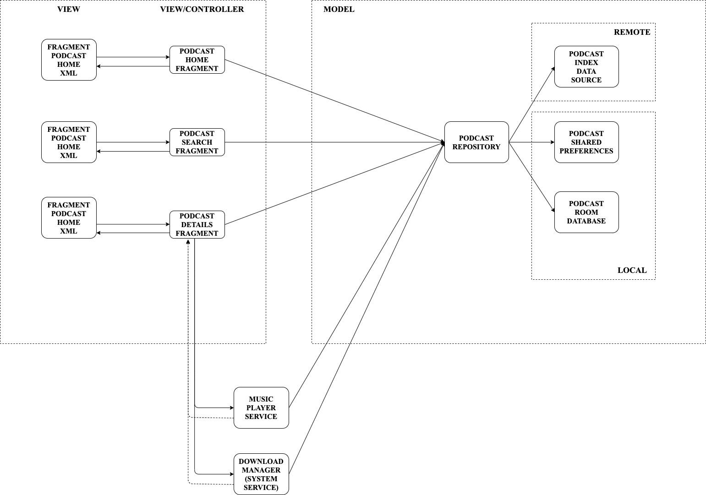

#### Podcast Player App

Esse App foi desenvolvido a API [PodcastIndex.org API](https://podcastindex-org.github.io/docs-api/#overview), que é uma API gratuita que provem dados de Podcasts.

Para poder rodar o APP, abra o seguinte arquivo: app/src/main/res/values/podcast_index_api_keys.xml. Nele você deve colocar o seu API secret e sua API key que dá para se obter gratuitamente no site acima.

Esse APP foi desenvolvido seguindo a arquitetura MVC. Segue um diagrama demonstrando como está o app:

Seguem prints do app rodando:

